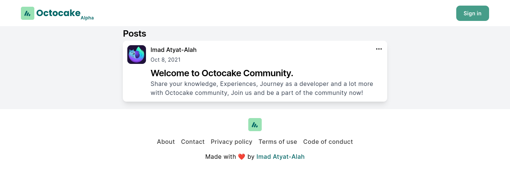

  

[Website][octocake-link]
·
[Report Bug][issues-link]
·
[Request Feature][issues-link]

[![CodeFactor][codefactor-image]][codefactor-link]
[![MIT License][license-image]][license-link]
![][typescript-image]
[![Stargazers][stars-image]][stars-link]
[![Forks][forks-image]][forks-link]

  

> **PRODUCTION ISSUE**: Auth is not working!

## About The Project

Octocake is an open-source social platform created for developers to share their knowledge, Experiences, Journey, and a lot more with the community. Inspired by big projects like [dev.to](https://dev.to/) and [hashnode](https://hashnode.com/).

Check out the [reasons behind why I have started Octocake](https://imadatyatalah.vercel.app/blog/why-i-have-started-octocake#why-i-have-started-octocake).

### Built With

- [TypeScript](https://www.typescriptlang.org/)
- [Next.js](https://nextjs.org/)
- [Express](https://expressjs.com/)

## Contributing

Please take a look at [`CONTRIBUTING.md`][contributing-link].

## License

Distributed under the MIT License. See [`LICENSE`][license-link] for more information.

  Built with ❤️ by <a href="https://imadatyatalah.vercel.app">Imad Atyat-Alah</a>

[octocake-link]: https://octocake.netlify.app
[codefactor-image]: https://www.codefactor.io/repository/github/octocake-dev/octocake/badge?style=for-the-badge
[codefactor-link]: https://www.codefactor.io/repository/github/octocake-dev/octocake
[license-image]: https://img.shields.io/github/license/Octocake-Dev/octocake?color=blue&style=for-the-badge
[license-link]: https://github.com/Octocake-Dev/octocake/blob/main/LICENSE
[typescript-image]: https://img.shields.io/badge/Typescript-294E80.svg?style=for-the-badge&logo=typescript
[stars-image]: https://img.shields.io/github/stars/Octocake-Dev/octocake?style=for-the-badge
[stars-link]: https://github.com/Octocake-Dev/octocake/stargazers
[forks-image]: https://img.shields.io/github/forks/Octocake-Dev/octocake?style=for-the-badge
[forks-link]: https://github.com/Octocake-Dev/octocake/network/members
[issues-link]: https://github.com/Octocake-Dev/octocake/issues
[contributing-link]: https://github.com/Octocake-Dev/octocake/blob/main/CONTRIBUTING.md
